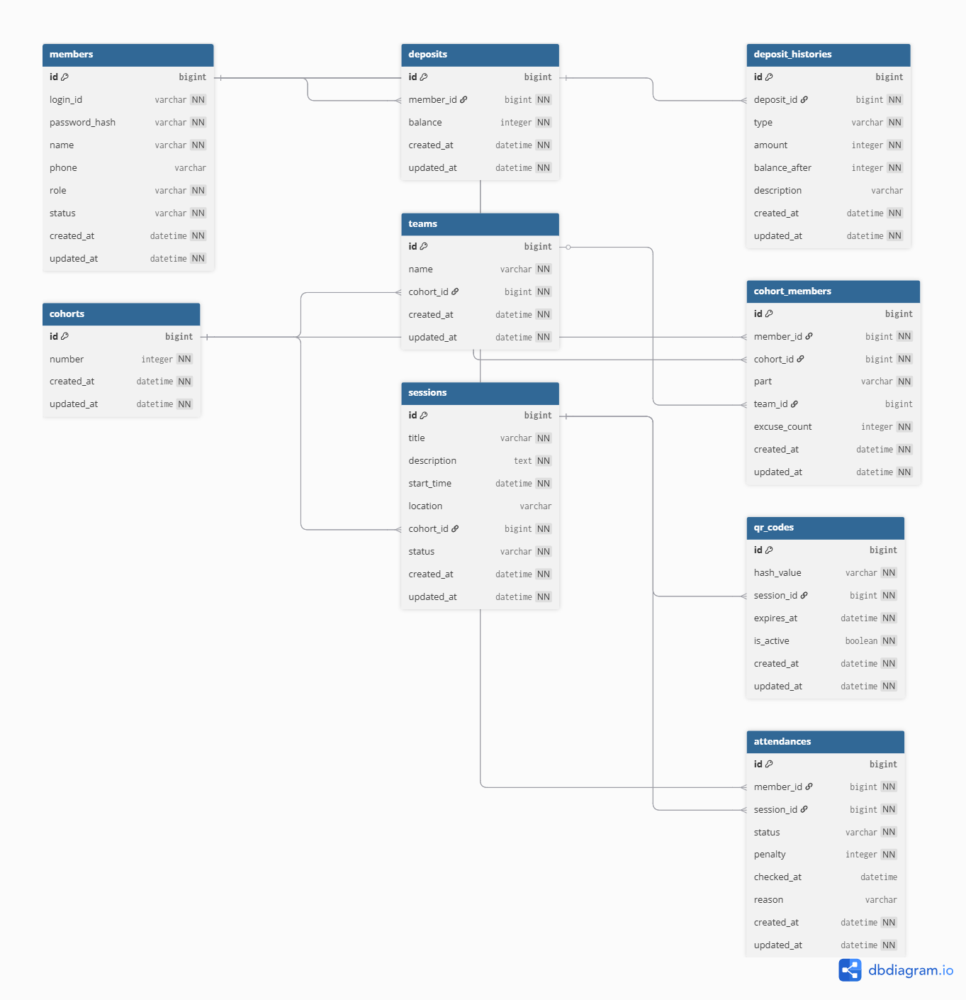
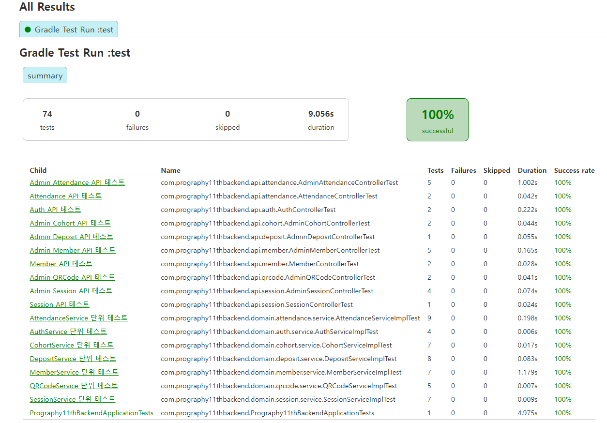

# Prography 11th Backend

프로그라피 11기 출결 관리 시스템 Backend

## 개발 환경

- **JDK**: bellsoft Liberica JDK 17
- **Spring Boot**: 4.0.3
- **Database**: H2 Database
- **Build Tool**: Gradle

## 실행 방법

### 1. 프로젝트 클론

```bash
git clone https://github.com/sevin98/prography-11th-backend.git
cd prography-11th-backend
```

### 2. 애플리케이션 실행

#### Gradle을 사용하는 경우

```bash
./gradlew bootRun
```

#### IDE에서 실행하는 경우

`Prography11thBackendApplication` 클래스를 실행합니다.

### 3. H2 Console 접속

서버 실행 후 브라우저에서 다음 URL로 접속:

```
http://localhost:8080/h2-console
```

**연결 정보:**
- JDBC URL: `jdbc:h2:file:./data/prography`
- 사용자명: `sa`
- 비밀번호: (비워두기)

### 4. 기본 계정

서버 시작 시 자동으로 생성되는 관리자 계정:

- **로그인 ID**: `admin`
- **비밀번호**: `admin1234`

## API 엔드포인트

### 헬스 체크
- `GET /health` - 서버 상태 확인

### 인증
- `POST /auth/login` - 로그인

### 회원 (일반)
- `GET /members/{id}` - 회원 조회
- `GET /members/{id}/attendance-summary` - 출결 요약

### 회원 (관리자)
- `POST /admin/members` - 회원 등록
- `GET /admin/members` - 회원 목록
- `GET /admin/members/{id}` - 회원 상세
- `PUT /admin/members/{id}` - 회원 수정
- `DELETE /admin/members/{id}` - 회원 탈퇴

### 기수 (관리자)
- `GET /admin/cohorts` - 기수 목록
- `GET /admin/cohorts/{id}` - 기수 상세

### 일정 (일반)
- `GET /sessions` - 일정 목록

### 일정 (관리자)
- `GET /admin/sessions` - 일정 목록
- `POST /admin/sessions` - 일정 생성
- `PUT /admin/sessions/{id}` - 일정 수정
- `DELETE /admin/sessions/{id}` - 일정 삭제

### QR 코드 (관리자)
- `POST /admin/sessions/{id}/qrcodes` - QR 생성
- `PUT /admin/qrcodes/{id}` - QR 갱신

### 출결 (일반)
- `POST /attendances` - QR 출석 체크
- `GET /attendances?memberId={id}` - 내 출결 기록

### 출결 (관리자)
- `POST /admin/attendances` - 출결 등록
- `PUT /admin/attendances/{id}` - 출결 수정
- `GET /admin/attendances/sessions/{id}` - 일정별 출결 목록
- `GET /admin/attendances/sessions/{id}/summary` - 일정별 출결 요약
- `GET /admin/attendances/members/{id}` - 회원 출결 상세

### 보증금 (관리자)
- `GET /admin/cohort-members/{id}/deposits` - 보증금 이력

## 시드 데이터

서버 시작 시 자동으로 생성되는 데이터:

- **기수**: 10기, 11기
- **팀**: 11기 Team A, Team B, Team C
- **관리자**: loginId: `admin`, password: `admin1234`
- **보증금**: 관리자 초기 보증금 100,000원
- **랜덤 유저**: 한글 이름을 가진 랜덤 유저 16명 (회원 등록 시 보증금 100,000원 자동 설정)

## 데이터베이스

H2 Database를 사용하며, 데이터는 `./data/prography.mv.db` 파일에 저장됩니다.

서버를 재시작해도 데이터가 유지됩니다.

## 프로젝트 구조

```
src/
├── main/
│   ├── java/
│   │   └── com/prography11thbackend/
│   │       ├── api/          # API 컨트롤러 및 DTO
│   │       ├── domain/       # 도메인 엔티티, 리포지토리, 서비스
│   │       ├── global/       # 전역 설정 및 예외 처리
│   │       └── Prography11thBackendApplication.java
│   └── resources/
│       └── application.properties
└── test/                     # 테스트 코드
```

## 기술 스택

- Spring Boot 4.0.3
- Spring Data JPA
- H2 Database
- Lombok
- BCrypt (비밀번호 암호화)

## 시스템 아키텍처

### 시스템 아키텍처 다이어그램


### 계층형 아키텍처 다이어그램


### 데이터베이스 ERD



## 테스트

### 테스트 실행 방법

프로젝트 루트에서 다음 명령어로 테스트를 실행할 수 있습니다:

```bash
./gradlew test
```

또는 IDE에서 `src/test/java` 디렉토리의 테스트 클래스를 실행할 수 있습니다.

### 테스트 커버리지

현재 프로젝트는 다음 테스트를 포함하고 있습니다:

- **API 통합 테스트**: 25개 API 엔드포인트 테스트 (Admin 19개, Member 6개)
- **서비스 단위 테스트**: 7개 서비스 레이어 테스트

### 테스트 결과

